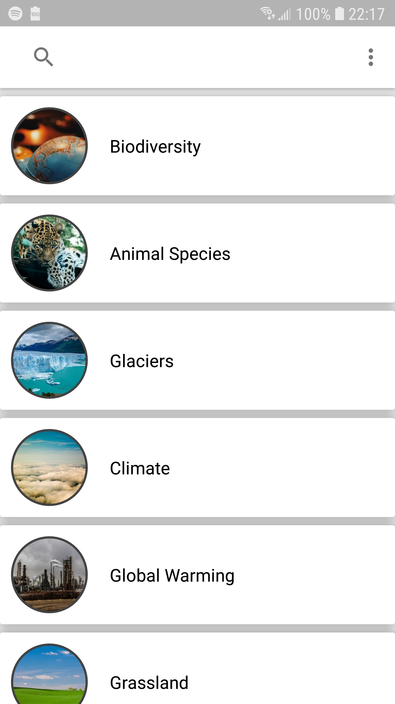
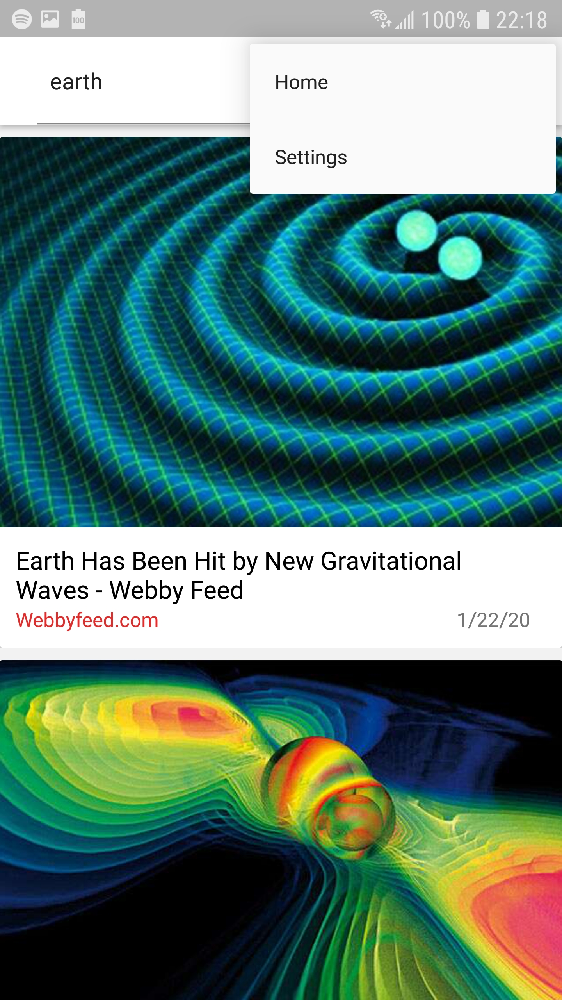
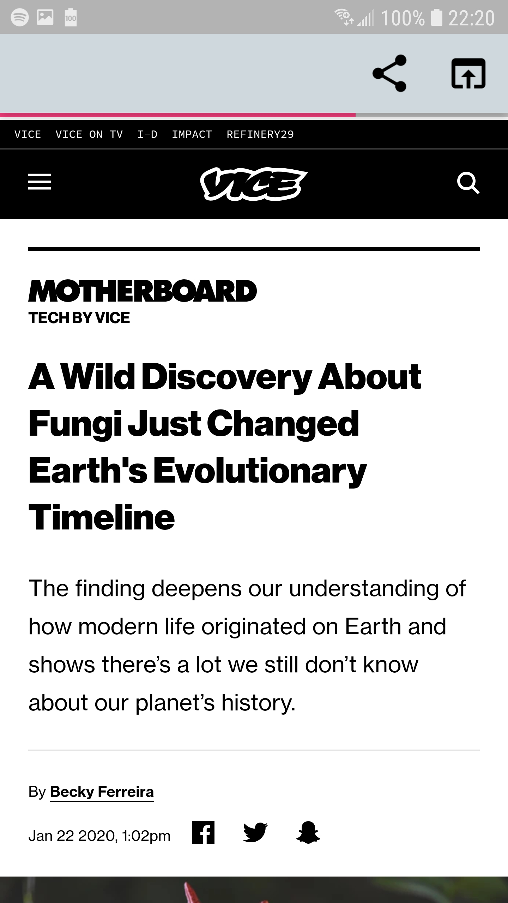
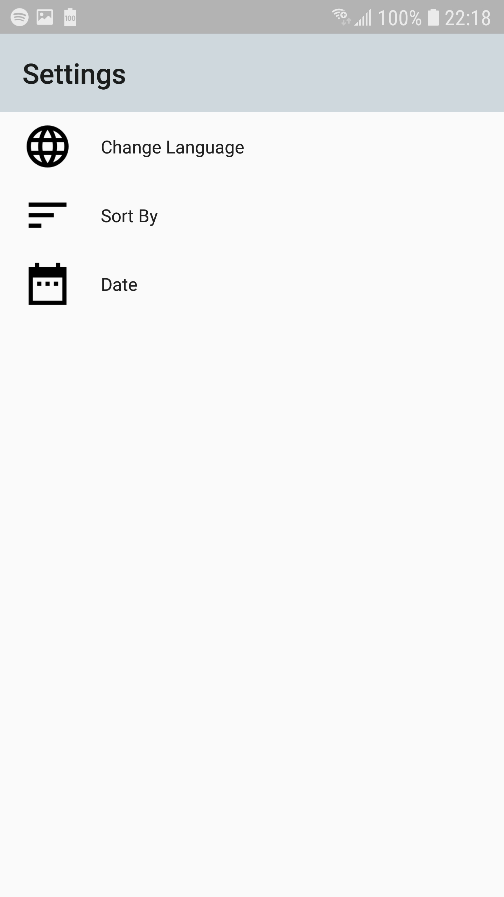
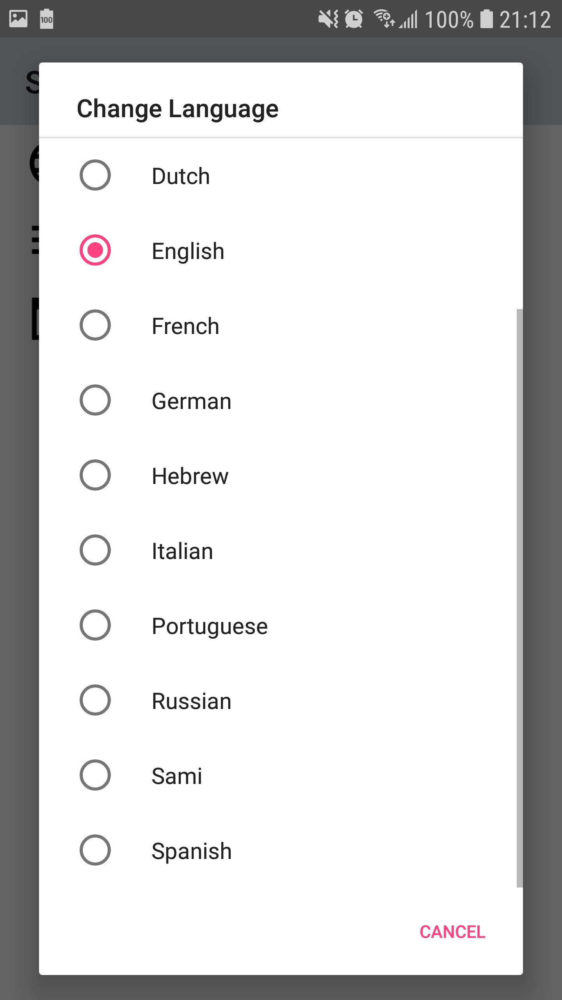

# Green News App

**Introduction**
> Find news about the earth and its climate, in addition to any news you want.

**Libraries / Tools**

* Glide: [https://github.com/bumptech/glide](https://github.com/bumptech/glide)
* NewsApi: [https://newsapi.org/](https://newsapi.org/)
* CircleImageView: [https://github.com/hdodenhof/CircleImageView](https://github.com/hdodenhof/CircleImageView)
* RetroFit: [https://square.github.io/retrofit/](https://square.github.io/retrofit/)

**App Architecture**

MVVM structural design pattern using LiveData observables and ViewModel.

**Features**
- Search news about various important topics about the earth.
- Using the search bar, find news about any topic.
- Sort search by Newest, relevannce, or popularity.
- Search news based on date.
- Search news of your language.
- Browse the news with WebView, with the option to share or open in another browser.

**Screenshots**

**Installation**
>
